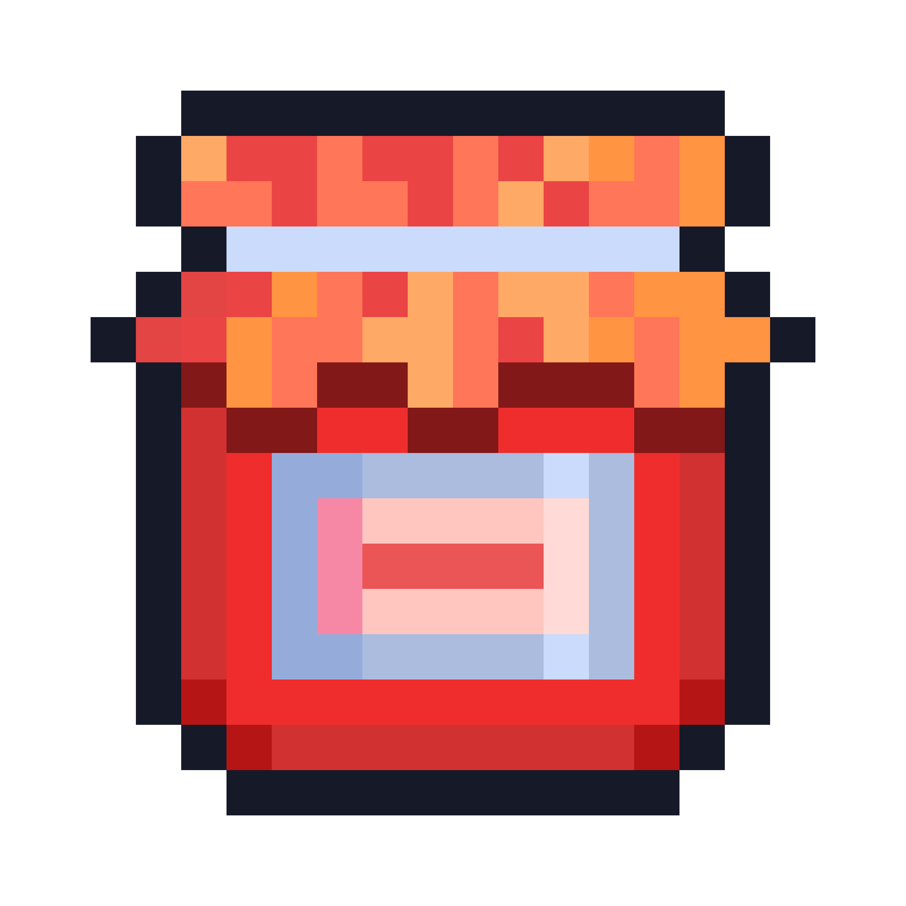

<div align="center">
  <a href="https://github.com/BenMcAvoy/jammy">
    
  </a>

  <h3 align="center">jammy</h3>

  <p align="center">
    A project jamming competition website
    <br />
    <a href="#" style="color: grey; text-decoration: none; pointer-events: none;">
        <strong>Visit the website »</strong>
    </a>
    <br />
    <br />
    <a href="https://github.com/BenMcAvoy/jammy/releases">Releases</a>
    ·
    <a href="https://github.com/BenMcAvoy/jammy/issues">Report Bugs</a>
    ·
    <a href="https://github.com/BenMcAvoy/jammy/issues">Request Features</a>
  </p>
</div>

## What is this?

Imagine a virtual [game jam](https://en.wikipedia.org/wiki/Game_jam) where you have to build a game in a week, now imagine it's for applications, games, websites, and more and it happens every week with a set [theme](https://en.wikipedia.org/wiki/Game_jam#Theme) like clockwork, that's jammy!

## Why?

I'm a software ["jammer"](https://en.wikipedia.org/wiki/Game_jam#History), and I love to "jam", but I also love to build things, so I thought it would be fun to make a jamming competition website that would let people see how they did, and maybe even win prizes.

## Implementation

The backend is wrote in Rust using [Poem](https://github.com/poem-web/poem) (and [Poem OpenAPI](https://github.com/poem-web/poem/tree/master/poem-openapi) for [Swagger](https://swagger.io/)). Frontends are currently a future detail and will be put here when ready.

## Contributing

Contributions are welcome! If you're interested in helping out, please check out the [contributing guidelines](CONTRIBUTING.md).

## License

This project is licensed under the MIT License - see the [LICENSE](LICENSE) file for details.

## Building

To build the project, you'll need to have [Rust](https://www.rust-lang.org/) installed. Once you have Rust installed, you can run the following commands to build the project:

```bash
cd backend
cargo build --release
./build/release/jammy
```

Once again, frontends are currently a future detail and will be put here when ready.
